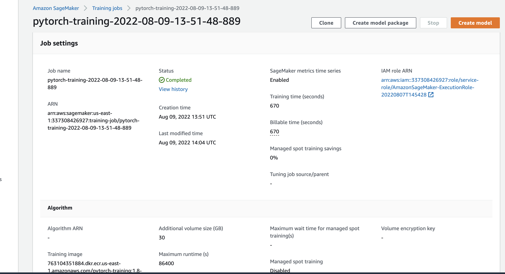

# Image Classification using AWS SageMaker

Use AWS Sagemaker to train a pretrained model that can perform image classification by using the Sagemaker profiling, debugger, hyperparameter tuning and other good ML engineering practices. This can be done on either the provided dog breed classication data set or one of your choice.

## Project Set Up and Installation
Enter AWS through the gateway in the course and open SageMaker Studio. 
Download the starter files.
Download/Make the dataset available. 

## Dataset
The provided dataset is the dogbreed classification dataset which can be found in the classroom.
The project is designed to be dataset independent so if there is a dataset that is more interesting or relevant to your work, you are welcome to use it to complete the project.

### Access
Upload the data to an S3 bucket through the AWS Gateway so that SageMaker has access to the data. 

## Hyperparameter Tuning
What kind of model did you choose for this experiment and why? Give an overview of the types of parameters and their ranges used for the hyperparameter search
I chose the learning rate and the batch-size as hyperparameters to tune. The learning rate is very important, as a wrong / to small learning rate can lead to overfitting, but a too large one might create non-optimal results as well.
The batch size is also very important as it controls the accuracy of the estimate of the error gradient when training neural networks.

hyperparameter_ranges = {
    "lr": ContinuousParameter(0.001, 0.1),
    "batch-size": CategoricalParameter([32, 64, 128, 256]),
}

Remember that your README should:
- Include a screenshot of completed training jobs

- Logs metrics during the training process
I did use logger in my hpo.py and train_model.py
- Tune at least two hyperparameters
I tuned batch size and the learning rate.
- Retrieve the best best hyperparameters from all your training jobs
Best hyperparameters:
{'_tuning_objective_metric': '"average test loss"',
 'batch-size': '"256"',
 'lr': '0.0010890341083269243'
 
## Debugging and Profiling
**TODO**: Give an overview of how you performed model debugging and profiling in Sagemaker
Debugging: I used Amazon SageMaker Debuggerfor debugging the model to check how well the model training is happening. I registered my model by creating a SMDebug hook in the main function and passed this hook to the tain and test functions with TRAIN and EVAL mode respectively. I configure the Debugger Rules and Hook Parameters of what should be tracked in the notebook train_and_deploy.ibynb

Profiling: I used Amazon Sagemaker Profiler to see how well I was using instance resources like the CPU and GPU Memory.
Using Sagemaker Profiler I monitored Instance metrics, GPU/CPU utilization and GPU/CPU memory utilization. A Profiling report was generated automatically. To use Sagemaker Profiler I also needed to create Profiler Rules and Configuration in the notebook that I passed to the Estimater.
Also here the configuration of a hook (here only one for Debugging and Profiling) in the training script is necessary.

### Results
**TODO**: What are the results/insights did you get by profiling/debugging your model?
**TODO**: If not, suppose there was an error. What would that error look like and how would you have fixed it?:
The EVAL error does not seem to decrease or rather increases after some training steps. This is a sign for overfitting. 
An idea would be to check when the loss is not decreasing anymore and in this case stop the training early (early stopping)
The output also shows if the weight initialisation was poor.

Some insights:
The profiler report shows that my training job started on 08/09/2022 at 13:53:27 and ran for 632 seconds.The most expensive operator on GPU was "enumerate(DataLoader)", which is to be expected, followed by conv2d. This is also true for CPU utilisation. 
Also, my training job spent quite a significant amount of time (44.07%) in phase "others". Ideally most of the training time should be spent on the TRAIN and EVAL phases.
My training instance provided 4 CPU cores, however your training job only ran on average 1 dataloader workers in parallel. It is recommended to increase the number of dataloader workers to me.
It also shows that my batch size of 256 was not too small.

**TODO** Remember to provide the profiler html/pdf file in your submission.
see profiler-report.html

## Model Deployment
**TODO**: Give an overview of the deployed model and instructions on how to query the endpoint with a sample input.

The deployed model is a Pytorch CNN model that is based on the ResNet50 model that was finetuned for the Dog Breed Classification task.
It has a linear fully connected output layer with output size 133 as there are 133 distinct dog breeds in the data provided.
I used a learning rate of 0.0010890341083269243 and a batch size of 256 as this gave best results according to the hyperparameter tuning.

To query the enpoint we have to get the endpoint using:
predictor = sagemaker.predictor.Predictor('pytorch-training-2022-08-09-14-18-19-119', sagemaker_session=sagemaker_session)
Then the sample image needs to be resized before it can be inputted to the redictor.predict(function as this was also done with training and testing images (they should all have the same size). Any transformation that was applied to the testing images will also need to be applied to the input images for prediction.

**TODO** Remember to provide a screenshot of the deployed active endpoint in Sagemaker.

## Standout Suggestions
**TODO (Optional):** This is where you can provide information about any standout suggestions that you have attempted.
